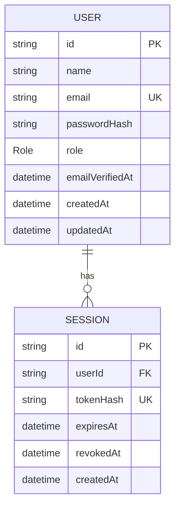

# Authentication System ER Diagram

```mermaid
erDiagram
    USER ||--o{ SESSION : has

    USER {
        string id PK
        string name
        string email UK
        string passwordHash
        Role role
        datetime emailVerifiedAt
        datetime createdAt
        datetime updatedAt
    }

    SESSION {
        string id PK
        string userId FK
        string tokenHash UK
        datetime expiresAt
        datetime revokedAt
        datetime createdAt
    }
```